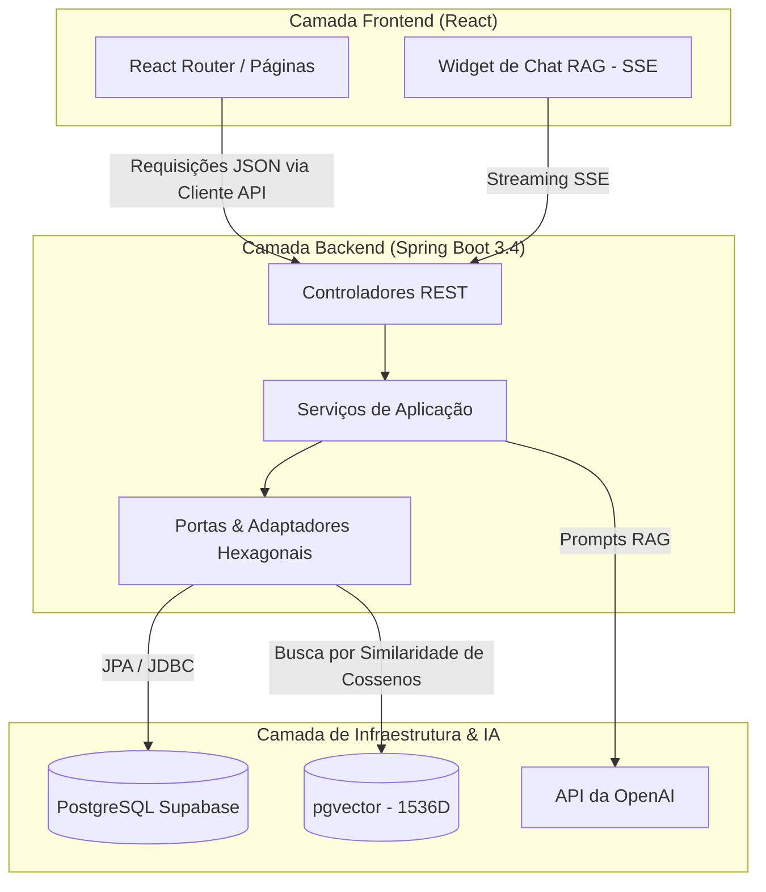

<div align="center">
  
  <h1>OmniGame AI</h1>
  <p><strong>Plataforma Inteligente de Modding de Jogos & Suporte Técnico RAG</strong></p>

  <p>
    <a href="#sobre">Sobre</a> •
    <a href="#arquitetura">Arquitetura</a> •
    <a href="#recursos-principais">Recursos</a> •
    <a href="#como-começar">Como Começar</a> •
    <a href="#referência-da-api">Referência da API</a>
  </p>
</div>

---

## 📖 Sobre o OmniGame AI

O OmniGame AI é uma plataforma SaaS AI-first projetada para resolver o "problema do caos" nas comunidades de modding de jogos. Atuando como um passo evolutivo além dos repositórios tradicionais de mods (como o Nexus Mods), ele combina um **catálogo agnóstico de jogos** com um **Assistente de IA RAG (Retrieval-Augmented Generation)** especializado chamado "The Collector".

A plataforma foi projetada para lidar com metadados extremamente dinâmicos para qualquer jogo usando um modelo **EAV (Entity-Attribute-Value)** e aproveita o **pgvector** para busca semântica em wikis de jogos e logs de solução de problemas.

---

## 🏗 Arquitetura & Stack Tecnológico

O projeto segue uma rigorosa **Arquitetura Hexagonal** no backend e um ecossistema React moderno no frontend, garantindo escalabilidade, manutenibilidade e qualidade de código a nível corporativo.

### Stack Tecnológico

- **Backend:** Java 21, Spring Boot 3.4
- **IA & Dados:** Spring AI, OpenAI (text-embedding-3-small, gpt-4o-mini), `pgvector`
- **Banco de Dados:** PostgreSQL (Supabase) com esquema EAV
- **Segurança:** JWT Stateless integrado com Supabase Auth
- **Frontend:** React 18, Vite, TypeScript, Tailwind CSS v3 (Interface Dark estilo Nexus)

### Diagrama de Design do Sistema



---

## ✨ Recursos Principais

### 1. Catálogo Agnóstico de Jogos (Modelo EAV)
Jogos diferentes exigem metadados muito diferentes (ex: Skyrim precisa de "Load Order", Minecraft precisa de "Forge Version"). O banco de dados usa um padrão **EAV (Entity-Attribute-Value)**:
- `games`: Catálogos raiz (Skyrim, Minecraft).
- `attributes`: Definições dinâmicas de campos (STRING, INTEGER, BOOLEAN).
- `game_entities`: Mods específicos, patches, assets.
- `entity_values`: A referência cruzada armazenando os metadados reais.

### 2. Assistente de IA "The Collector" (Pipeline RAG)
Uma interface de chat inteligente que atua como um especialista em modding.
- O contexto é carregado da tabela `game_knowledge` usando **similaridade de cossenos do pgvector**.
- As respostas em tempo real são transmitidas para o frontend React via **Server-Sent Events (SSE)**.
- Reconhece o contexto do jogo selecionado atualmente.

### 3. Interface Dark estilo Nexus
Uma experiência premium de frontend construída com Tailwind CSS.
- Painéis em glassmorphism (efeito vidro) e efeitos de brilho dinâmicos.
- Badges de auditoria de segurança e chips de filtro por tipo de entidade.
- Widget de chat "slide-over" contínuo e responsivo para suporte técnico contínuo.

---

## 🚀 Como Começar

### Pré-requisitos

- **Java 21** ou superior
- **Maven 3.8+**
- **Node.js 18+** e `npm`
- **Conta Supabase** (para PostgreSQL + pgvector + Auth)
- **Chave de API OpenAI**

### 1. Configuração do Banco de Dados (Supabase)

1. Crie um novo projeto no Supabase.
2. Navegue até o SQL Editor e execute o arquivo `schema.sql` localizado em `backend/src/main/resources/schema.sql`.
3. Este script irá automaticamente:
   - Ativar as extensões `uuid-ossp` e `vector`.
   - Criar todas as tabelas EAV e de Usuários.
   - Inserir dados semente (seed data) de desenvolvimento para 5 jogos populares.

### 2. Configuração do Backend

Navegue para o diretório `backend`. Crie um arquivo `.env` ou exporte as seguintes variáveis (correspondendo à estrutura do seu `application.yml`):

```bash
export SUPABASE_DB_HOST="seu-projeto.supabase.co"
export SUPABASE_DB_NAME="postgres"
export SUPABASE_DB_USER="postgres"
export SUPABASE_DB_PASSWORD="sua-senha-segura"
export OPENAI_API_KEY="sk-sua-chave-openai"
export SUPABASE_JWT_SECRET="seu-secret-jwt-supabase"
```

Execute o backend:
```bash
mvn spring-boot:run
```
*O servidor iniciará na porta `8080`.*

### 3. Configuração do Frontend

Navegue para o diretório `frontend`. Instale as dependências e inicie o servidor de desenvolvimento Vite:

```bash
cd frontend
npm install
npm run dev
```
*O frontend iniciará na porta `5173`. Requisições de API são automaticamente roteadas (proxied) para `localhost:8080`.*

---

## 📡 Visão Geral da Referência da API

A API segue princípios RESTful e a RFC 7807 para relatórios de erros.

### Autenticação
Todas as rotas protegidas requerem um token `Bearer` contendo um JWT válido do Supabase Auth. Definido via cabeçalho `Authorization`.

### Recurso: Jogos (`/api/v1/games`)

- `GET /api/v1/games?page=0&size=20` - Lista catálogos de jogos.
- `GET /api/v1/games/{slug}` - Obtém detalhes de um jogo específico.
- `GET /api/v1/games/search?query=skyrim` - Busca de texto completo em jogos.
- `POST /api/v1/games` (Admin) - Cria um novo catálogo de jogo.

### Recurso: The Collector (`/api/v1/collector`)

#### Chat Stream
`POST /api/v1/collector/chat`

Endpoint para interagir com a IA RAG. Requer um cliente `text/event-stream`.

**Payload da Requisição:**
```json
{
  "gameSlug": "skyrim",
  "message": "Como eu corrijo o crash de load order do SKSE?",
  "conversationHistory": [
    { "role": "user", "content": "Olá" },
    { "role": "assistant", "content": "Como posso ajudar?" }
  ]
}
```

**Resposta (Formato SSE):**
```text
data: Baseado
data: na
data: sua
data: load order...
```

---

## 🛡 Segurança & Melhores Práticas

- **Tokens Stateless (Sem Estado):** Zero estado de sessão no servidor; totalmente guiado por JWT via Supabase.
- **Tratamento Global de Erros:** Todos os erros de API são interceptados e formatados como objetos JSON `ProblemDetail`.
- **Proxies de API:** O servidor de dev do Vite atua como proxy para as chamadas de API, evitando problemas de CORS durante o desenvolvimento local.

<div align="center">
  <p>Construído como um Case de Estudo AI-First para o <strong>TCU - Núcleo de IA (NIA)</strong>.</p>
</div>
