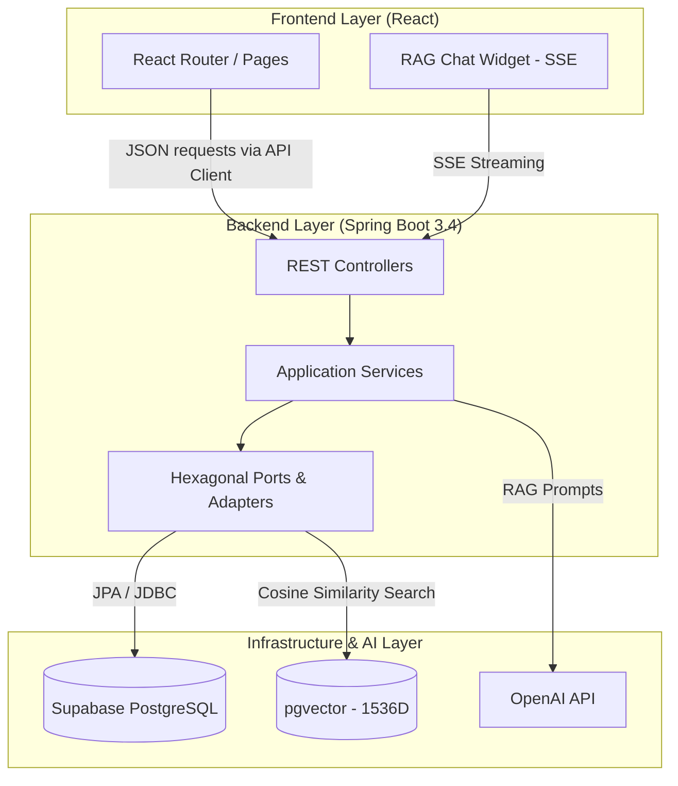

<div align="center">
  
  <h1>OmniGame AI</h1>
  <p><strong>Intelligent Game Modding Platform & RAG Technical Support</strong></p>

  <p>
    <a href="#about">About</a> •
    <a href="#architecture">Architecture</a> •
    <a href="#core-features">Features</a> •
    <a href="#getting-started">Getting Started</a> •
    <a href="#api-reference">API Reference</a>
  </p>
</div>

---

## 📖 About OmniGame AI

OmniGame AI is an AI-first SaaS platform designed to solve the "chaos problem" in game modding communities. Acting as an evolutionary step beyond traditional mod repositories (like Nexus Mods), it combines a **game-agnostic catalog** with a specialized **RAG (Retrieval-Augmented Generation) AI Assistant** named "The Collector."

The platform is designed to handle extremely dynamic metadata for any game using an **Entity-Attribute-Value (EAV)** model and leverages **pgvector** for semantic search over game wikis and troubleshooting logs.

---

## 🏗 Architecture & Tech Stack

The project follows a rigorous **Hexagonal Architecture** on the backend and a modern React ecosystem on the frontend, ensuring scalability, maintainability, and enterprise-grade code quality.

### Tech Stack

- **Backend:** Java 21, Spring Boot 3.4
- **AI & Data:** Spring AI, OpenAI (text-embedding-3-small, gpt-4o-mini), `pgvector`
- **Database:** PostgreSQL (Supabase) with EAV Schema
- **Security:** Stateless JWT integrated with Supabase Auth
- **Frontend:** React 18, Vite, TypeScript, Tailwind CSS v3 (Nexus-style Dark UI)

### System Design Diagram



---

## ✨ Core Features

### 1. Game-Agnostic Catalog (EAV Model)
Different games require vastly different metadata (e.g., Skyrim needs "Load Order", Minecraft needs "Forge Version"). The database uses an **EAV (Entity-Attribute-Value)** pattern:
- `games`: Root catalogs (Skyrim, Minecraft).
- `attributes`: Dynamic field definitions (STRING, INTEGER, BOOLEAN).
- `game_entities`: Specific mods, patches, assets.
- `entity_values`: The cross-reference storing the actual metadata.

### 2. "The Collector" AI Assistant (RAG Pipeline)
An intelligent chat interface that acts as a modding expert.
- Context is loaded from the `game_knowledge` table using **pgvector cosine similarity**.
- Real-time responses are streamed to the React frontend via **Server-Sent Events (SSE)**.
- Context-aware of the currently selected game.

### 3. Nexus-Style Dark UI
A premium frontend experience built with Tailwind CSS.
- Glassmorphism panels and dynamic glow effects.
- Security audit badges and entity type filter chips.
- Seamless, responsive "slide-over" chat widget for ongoing technical support.

---

## 🚀 Getting Started

### Prerequisites

- **Java 21** or higher
- **Maven 3.8+**
- **Node.js 18+** and `npm`
- **Supabase Account** (for PostgreSQL + pgvector + Auth)
- **OpenAI API Key**

### 1. Database Setup (Supabase)

1. Create a new Supabase project.
2. Navigate to the SQL Editor and execute the `schema.sql` file located at `backend/src/main/resources/schema.sql`.
3. This script will automatically:
   - Enable `uuid-ossp` and `vector` extensions.
   - Create all EAV and User tables.
   - Insert development seed data for 5 popular games.

### 2. Backend Configuration

Navigate to the `backend` directory. Create a `.env` file or export the following variables (matching your `application.yml` structure):

```bash
export SUPABASE_DB_HOST="your-project.supabase.co"
export SUPABASE_DB_NAME="postgres"
export SUPABASE_DB_USER="postgres"
export SUPABASE_DB_PASSWORD="your-secure-password"
export OPENAI_API_KEY="sk-your-openai-key"
export SUPABASE_JWT_SECRET="your-supabase-jwt-secret"
```

Run the backend:
```bash
mvn spring-boot:run
```
*The server will start on port `8080`.*

### 3. Frontend Configuration

Navigate to the `frontend` directory. Install dependencies and start the Vite dev server:

```bash
cd frontend
npm install
npm run dev
```
*The frontend will start on port `5173`. API requests are automatically proxied to `localhost:8080`.*

---

## 📡 API Reference Overview

The API follows RESTful principles and RFC 7807 for error reporting.

### Authentication
All protected routes require a `Bearer` token containing a valid Supabase Auth JWT. Set via the `Authorization` header.

### Resource: Games (`/api/v1/games`)

- `GET /api/v1/games?page=0&size=20` - List game catalogs.
- `GET /api/v1/games/{slug}` - Get details for a specific game.
- `GET /api/v1/games/search?query=skyrim` - Full-text search games.
- `POST /api/v1/games` (Admin) - Create a new game catalog.

### Resource: The Collector (`/api/v1/collector`)

#### Chat Stream
`POST /api/v1/collector/chat`

Endpoint for interacting with the RAG AI. Requires a `text/event-stream` client.

**Request Payload:**
```json
{
  "gameSlug": "skyrim",
  "message": "How do I fix the SKSE load order crash?",
  "conversationHistory": [
    { "role": "user", "content": "Hello" },
    { "role": "assistant", "content": "How can I help?" }
  ]
}
```

**Response (SSE Format):**
```text
data: Based
data: on
data: the
data: load order...
```

---

## 🛡 Security & Best Practices

- **Stateless Tokens:** Zero session state on the server; entirely JWT driven via Supabase.
- **Global Error Handling:** All API errors are intercepted and formatted as `ProblemDetail` JSON objects.
- **API Proxies:** The Vite dev server proxies API calls to avoid CORS issues during local development.

<div align="center">
  <p>Built as an AI-First Case Study for <strong>TCU - Núcleo de IA (NIA)</strong>.</p>
</div>
